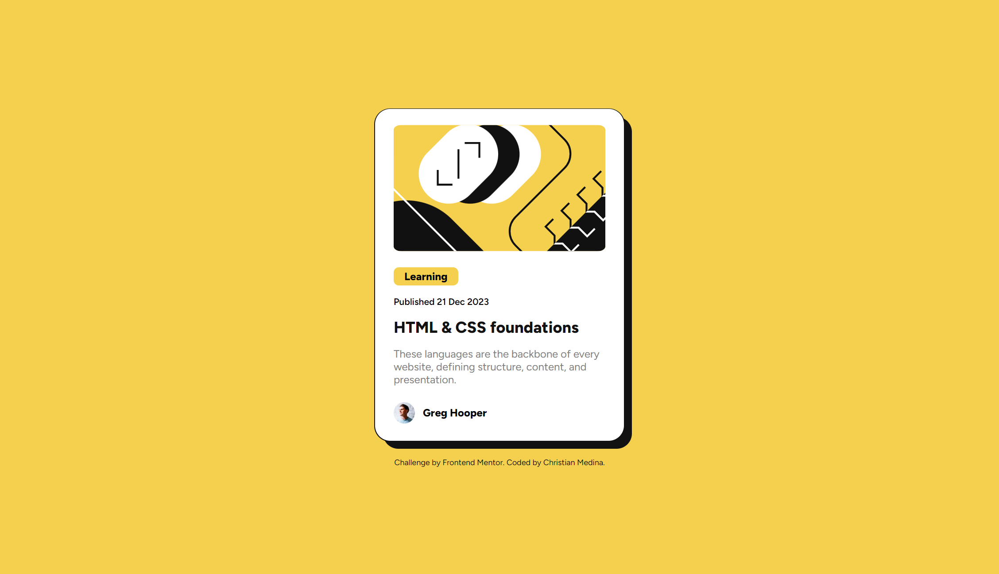

# Frontend Mentor - Blog preview card solution

This is a solution to the [Blog preview card challenge on Frontend Mentor](https://www.frontendmentor.io/challenges/blog-preview-card-ckPaj01IcS). Frontend Mentor challenges help you improve your coding skills by building realistic projects.

## Table of contents

- [Overview](#overview)
  - [The challenge](#the-challenge)
  - [Screenshot](#screenshot)
  - [Links](#links)
- [My process](#my-process)
  - [Built with](#built-with)
  - [What I learned](#what-i-learned)
  - [Continued development](#continued-development)
- [Author](#author)

## Overview

### The challenge

Users should be able to:

- See hover and focus states for all interactive elements on the page

### Screenshot



### Links

- Solution URL: [Add solution URL here](https://your-solution-url.com)
- Live Site URL: [Add live site URL here](https://your-live-site-url.com)

## My process

### Built with

- Semantic HTML5 markup
- Flexbox
- [TypeScript](https://www.typescriptlang.org/) - For injecting scss
- [Sass](https://sass-lang.com/) - For styles
- [React](https://reactjs.org/) - Front-end library

**Note: These are just examples. Delete this note and replace the list above with your own choices**

### What I learned

This is the first project where I have combined both React and TypeScript. This came with learning how the two interact together, like creating interfaces for props:

```typescript
interface PreviewCardProps {
  url: string;
  tagList: string[];
  date: string;
  title: string;
  text: string;
  author: string;
}

const PreviewCard = (cardProps: PreviewCardProps) => {
  return (
    <>
      <div className={card.frame}>
        <div className={card.container}>
          <PreviewCardImage url={cardProps.url} />
          <TagList tagList={cardProps.tagList} />
          <PreviewCardDate date={cardProps.date} />
          <PreviewCardTitle title={cardProps.title} />
          <PreviewCardText text={cardProps.text} />
          <PreviewCardAvatar author={cardProps.author} />
        </div>
      </div>
    </>
  );
};
```

### Continued development

I plan to continue learning more React while maintaining strong typings through TypeScript, and eventually introducing possible frameworks such as Vue or Svelte.

## Author

- Website - [Christian Medina](https://www.github.com/cmedina-dev)
- Frontend Mentor - [@cmedina-dev](https://www.frontendmentor.io/profile/cmedina-dev)
- LinkedIn - [@cjmedina3](https://linkedin.com/in/cjmedina3)
